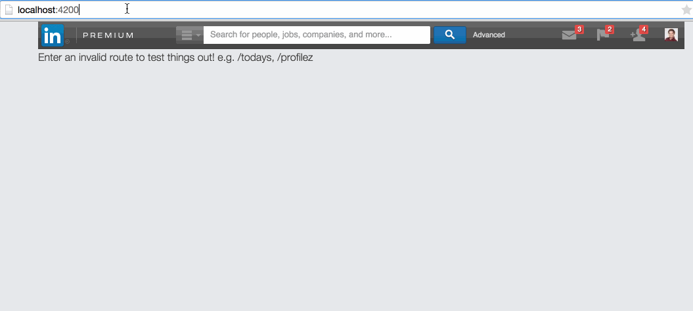

# 404 demo

The goals of my "hackday" project:
* Play with ember, and use it as a way to prototype a 404 implementation idea
* Demonstrate how a 404 page could be used to predict a user's action. Perhaps they just mistyped the URL -- we should be able to cue off of that and present a valid URL or action.
* When all else fails, demonstrate how a 404 page could ask about a user's intent, if we have no clue how/why they reached this page. This is a growth/engagement opportunity.

## Animated GIF demo

## More (boring) info

Essentially, there is a global path handler that renders a template for any unmatched route (in this case, anything except the "index"). The path is passed to the model for this route, and [Fuse.js](http://kiro.me/projects/fuse.html) is used to fuzzy match against a list of predetermined routes. Ideally, the routes would be dynamically included/generated, and the matching algorithm would happen before the response is sent down to the browser so that the appropriate modules and text could be cherry-picked, rather than all sent down to the client.

## Prerequisites

You will need the following things properly installed on your computer.

* [Git](http://git-scm.com/)
* [Node.js](http://nodejs.org/) (with NPM)
* [Bower](http://bower.io/)
* [Ember CLI](http://www.ember-cli.com/)
* [PhantomJS](http://phantomjs.org/)
* Optional - [Charles](http://www.charlesproxy.com/) If you want to iframe some external page's header locally. (For demo/prototyping purposes).

## Installation

* `git clone <repository-url>` this repository
* change into the new directory
* `npm install`
* `bower install`

## Running / Development

* `ember server`
* Visit your app at [http://localhost:4200](http://localhost:4200).

### Code Generators

Make use of the many generators for code, try `ember help generate` for more details

### Running Tests

* `ember test`
* `ember test --server`

### Building

* `ember build` (development)
* `ember build --environment production` (production)

### Deploying

Specify what it takes to deploy your app.

## Further Reading / Useful Links

* [ember.js](http://emberjs.com/)
* [ember-cli](http://www.ember-cli.com/)
* Development Browser Extensions
  * [ember inspector for chrome](https://chrome.google.com/webstore/detail/ember-inspector/bmdblncegkenkacieihfhpjfppoconhi)
  * [ember inspector for firefox](https://addons.mozilla.org/en-US/firefox/addon/ember-inspector/)

